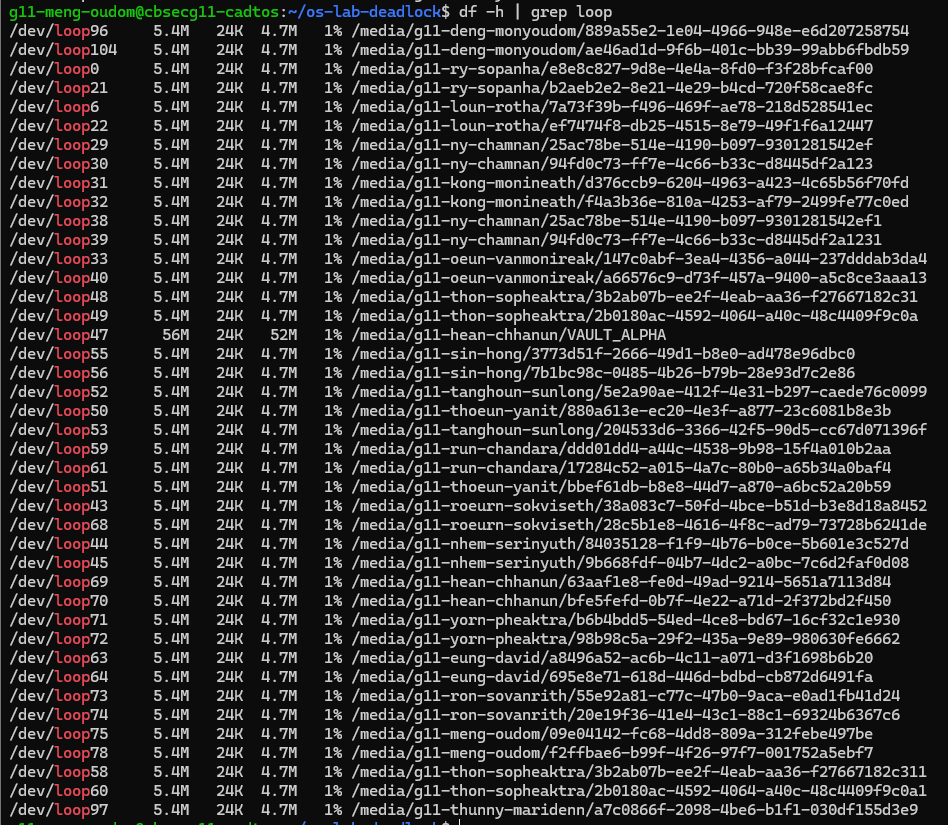
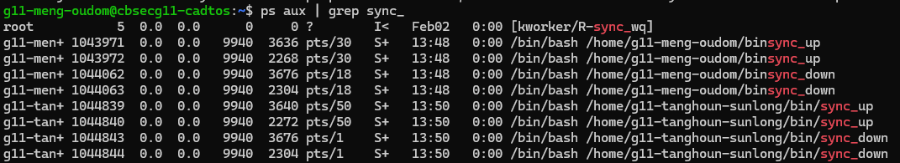
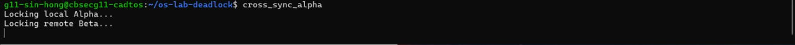
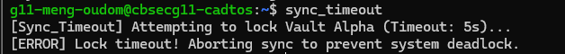
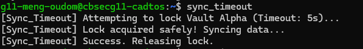
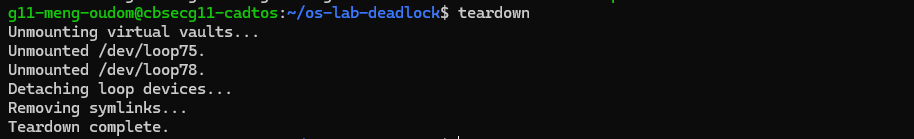
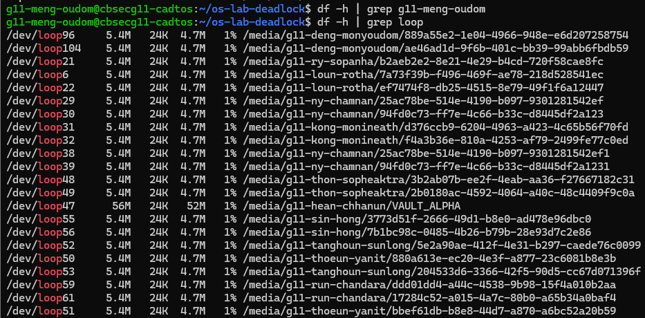

# Level 1

#### Screenshot:

#### Explanation:

The `df -h | grep loop` output proves that both virtual disk image files were successfully attached as loopback devices and mounted into the filesystem. This confirms that the `.img` files are now behaving like real storage volumes and can be accessed through their mount points.

# Level 2 & 3

#### Screenshot:

#### Explanation:

The deadlock occurred because `sync_up` acquired the Alpha lock first and then waited for the Beta lock, while `sync_down` acquired the Beta lock first and then waited for the Alpha lock. Each process held one resource and waited for the other, creating a circular wait condition. Since neither process could proceed or release its lock, both scripts froze indefinitely.

# Level 4

#### Screenshot:

##### Beta (Locked):

##### Alpha (Locked):

##### Both Alpha $ Beta Process (Locked):

The distributed deadlock occurred when two users executed synchronization scripts simultaneously. Each user locked their local vault first and then attempted to lock the partner’s vault. Since both processes held one resource and waited for the other, neither could proceed. This simulates a distributed denial-of-service scenario where multiple systems become unresponsive due to circular resource dependency.

# Level 5

##### Beta (Success):

##### Alpha (Success):

The deadlock was prevented by enforcing a global resource ordering rule. Both synchronization scripts were modified to acquire the Alpha lock first and the Beta lock second, regardless of sync direction. This broke the circular wait condition because no process could hold Beta while waiting for Alpha. As a result, one process waited safely until the other completed, and both scripts finished sequentially without freezing.

# Level 6

##### If the sync_timeout waits longer than 5s:

You can say the lock was intentionally held longer than the timeout period to verify that the recovery mechanism aborts safely instead of freezing.

##### If the sync_timeout doesn't reach 5s:

# Level 7

##### Running the teardown script:

##### Confirming the loopback devices are removed:

The teardown process safely unmounted the virtual filesystems and detached the loopback devices from the system. This prevents resource leakage and avoids potential filesystem corruption. Proper cleanup ensures that no orphaned loop devices remain active in the kernel, maintaining system stability.
